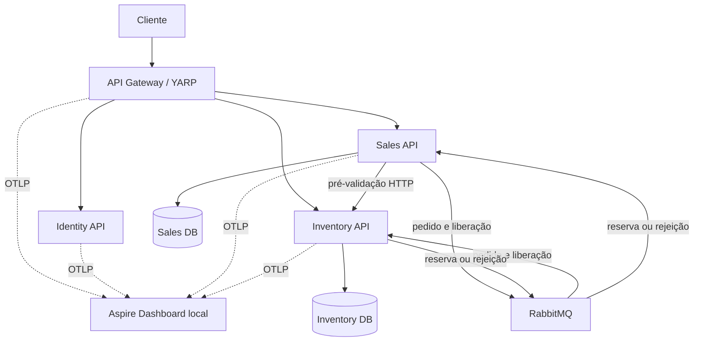

# Visão de contêineres

O Gateway autentica, autoriza, limita e encaminha. Sales e Inventory validam novamente o JWT e não compartilham tabelas. A consulta HTTP é uma pré-validação rápida; a reserva definitiva ocorre por eventos. Outbox, publisher confirms, confirmação manual e Inbox fecham as janelas de falha sem prometer entrega exatamente uma vez. Em desenvolvimento, os serviços exportam traces e métricas por OTLP ao Aspire Dashboard; em produção, o destino é um OpenTelemetry Collector gerenciado.
